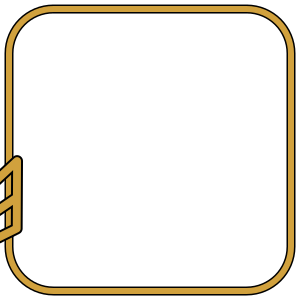

# FletchApps

Portail qui présente et relie les projets Fletch : FletchScore,
FletchTime, FletchLog, FletchGames et FletchStock.

*Portal presenting and linking the Fletch projects: FletchScore,
FletchTime, FletchLog, FletchGames and FletchStock.*

Portés par [Les Aigles 77 / Archers Libres de Fontaine-le-Port](https://github.com/MrFanghoDev).

## Statut

Une seule page (`index.html`), une carte par projet avec sa version et
son statut (récupérés en direct depuis les Releases GitHub de chaque
dépôt). Voir les [Issues](https://github.com/MrFanghoDev/fletchapps/issues)
pour les idées en cours.

## Ce que c'est

Une page web statique, sans backend ni compte : chaque carte pointe
vers le dépôt/l'appli du projet correspondant. `theme.css` définit
l'identité visuelle (palette, typographie) partagée par les GUI et
pages web des projets Fletch.

## Faire tourner en local

Aucune installation ni build nécessaire (HTML/CSS pur, aucune
dépendance) -- ouvre simplement `index.html` dans un navigateur, ou
sers le dossier avec un petit serveur local si tu préfères :

```bash
git clone https://github.com/MrFanghoDev/fletchapps.git
cd fletchapps
python3 -m http.server 8080
# puis ouvrir http://localhost:8080/ dans un navigateur
```

## Licence

[GPLv3](LICENSE).

---

Développé pour / Built for les Archers Libres de Fontaine-le-Port --
[@MrFanghoDev](https://github.com/MrFanghoDev) -- [Licence GPLv3 / GPLv3 License](https://github.com/MrFanghoDev/fletchapps/blob/master/LICENSE)
